# 项目核心：柴油机空气系统的多变量控制

这个项目的核心是控制一个2输入2输出（MIMO）的线性系统。

* 系统: 柴油发动机空气系统。
* 输入 (u):
  1. u1: VGT（可变几何涡轮）的叶片位置
  2. u2: EGR（废气再循环）的阀门位置
* 输出 (y):
  1. y1: 缸内空燃比 (AFR)<mark></mark>
  2. y2: 进气歧管EGR百分比
* 模型: 项目提供了一个四阶的状态空间模型 (ẋ = Ax + Bu, y = Cx)，其中的 A, B, C 矩阵参数取决于您学号的后四位数字 (a = 8, b = 4, c = 0, d = 1)。

物理系统本身（如图2所示）存在显著的**耦合**：调整VGT不仅会改变空气流量（影响AFR），也会改变排气背压，从而影响EGR的流量；同样，调整EGR阀门也会反过来影响到整个系统的气流动态。因此，这个项目本质上是一个典型的**解耦控制**问题，并在此基础上考察了现代控制理论中的多种核心设计方法。

## 设计规范

状态空间模型(1)中所有输出y的瞬态阶跃响应性能规范如下：

1) 超调量小于10%。

2) 2%沉降时间小于20秒。

注：(a)通过为每个输入通道施加阶跃参考信号（即[1,0]和[0,1]），在初始条件为零的情

况下验证瞬态响应；(b)对于后续任务1)至5)，您的控制系统需满足该性能规范，并完成每个

任务的必要研究。

---

## 各任务的详细分析与理论关联

我们正在控制一个柴油发动机的空气系统。这个系统的目标是<mark>精确控制进入气缸的空燃比(AFR)和废气再循环率(EGR)</mark>。

* 为什么需要控制？ 为了满足日益严格的排放法规（减少NOx和PM），同时还要保证发动机的性能和燃油经济性。

* <mark>如何控制？ 通过调节两个主要的执行器：VGT（可变几何涡轮）和EGR阀</mark>。
  这个控制问题很复杂，因为<mark>VGT和EGR的调节是相互影响（耦合）</mark>的。例如，调节VGT会影响EGR，反之亦然。直接手动调节或者用简单的单回路控制器效果很差
  。因此，我们需要一个“聪明”的控制器，也就是我们正在设计的状态反馈控制器，来同时协调这两个执行器，让AFR和EGR两个输出都达到我们想要的目标值。

* <mark>任务1“所有四个状态变量”是哪四个？</mark>
  这是最让人困惑的地方，也是理论模型和物理现实的一个关键区别。
  
  * 物理上，发动机系统里有许多物理量，比如涡轮转速、进气压力、温度等等。
  
  * 模型上，项目文件（Page 3-4）明确指出，我们使用的这个状态空间模型 (ẋ = Ax + Bu) 是通过系统辨识的方法从实验数据中得到的。
    这意味着：这<mark>四个状态变量 `x1, x2, x3, x4`</mark> 并没有直接、明确的物理意义。
    它们不是像“涡轮转速”或“进气压力”这样可以直接测量的物理量。它们是数学模型在拟合真实系统动态时，内部产生的一组中间变量。
    这在工程上很常见。
    只要这个数学模型能够准确地描述“我们操作输入（VGT/EGR）”和“我们关心的输出（AFR/EGR率）”之间的关系，那么这个模型就是有用的。
    
    

---

## 任务 1: 极点配置状态反馈控制器  - chapter 7

任务要求原文：

Assume that you can measure all the four state variables, design a state feedback controller using the pole place method, simulate the designed system, check the step responses and show all the four state responses to non-zero initial state with zero external inputs. Discuss effects of the positions of the poles on system performance, and also monitor control signal size. In this step, both the disturbance and set point can be assumed to be zero. (15 points)

> * **<mark>任务1的设计是在设计什么？</mark>**
>   一句话总结：任务1是在设计一个“大脑”（控制器），这个大脑通过读取发动机的（假想的）内部状态，来决定如何精细地调节VGT和EGR，从而让整个发动机 系统的响应变得又快又稳。 我们通过“极点配置”来实现这个目标。
> 
> * 什么是“极点”？
>   您可以把它理解为决定一个系统动态特性的“基因”。极点的位置决定了系统在受到扰动后，是会快速稳定下来、缓慢摇晃、还是会发散崩溃。
> 
> * 什么是“极点配置”？ 
>   我们通过设计反馈矩阵 K，可以人为地、随心所欲地移动闭环系统的极点到S平面的任何我们想要的位置。
> 
> * **<mark>为什么要做这个？</mark>**
>   
>   1. 保证稳定：原始的发动机系统（开环系统）可能不稳定或响应很差。通过状态反馈，我们可以把所有极点都移动到S平面的左半边，确保系统绝对稳定。
>   2. 提升性能：我们可以把极点放置在能满足“稳定时间<5秒，超调<10%”这些具体指标的“最佳位置”。比如，把极点放在离虚轴远一点的地方，响应就会更快（稳定时间短）；调整极点的虚部和实部之比，就可以控制超调。
>   
>   <mark>**所以，任务1的完整逻辑链是：**</mark>
> 1. 对象：一个用A, B, C矩阵描述的柴油机空气系统数学模型。
> 2. 目标：让这个系统的动态响应满足给定的性能指标（快、稳、准）。
> 3. 手段：设计一个状态反馈控制器 <mark>u = -Kx</mark>。
> 4. 核心技术：使用极点配置法来计算出能实现我们目标的反馈矩阵 K。
> 5. 验证：在MATLAB/Simulink中仿真，看看加上我们设计的控制器后，系统的表现是否真的如我们所愿。同时观察控制信号 u (即VGT和EGR的调节指令)
> - <mark>**为什么任务1是 `u = -Kx` 而不是 `u = -Kx + Fr`？**</mark>
>   这主要是由任务1的具体要求决定的，并且有充分的理论支撑。
> 1. 任务1的目标是“调节问题”（Regulation Problem）：
>    
>    * 请回顾任务1的描述：“假设可以测量所有四个状态变量，使用极点位置法设计状态反馈控制器，对设计的系统
>      进行仿真，检查阶跃响应，并显示所有四个状态在非零初始状态和零外部输入下的响
>      应。讨论极点位置对系统性能的影响，并监测控制信号的幅值。<mark>在此步骤中，扰动和设定值可以假设为零。</mark>”
>    
>    * 当“设定值”（reference input）r 为零时，控制律 u = -Kx + Fr 自然就简化为 u = -Kx。
>    
>    * 调节问题的目标是将系统状态从非零初始条件（例如 $x_0 = [0.5, -0.1, 0.3,
>      -0.8]^T$）或在扰动下，稳定地带回到原点（零状态）。在这种情况下，我们不需要一个 Fr 项来跟踪一个非零的设定值。<mark>K矩阵的作用就是通过改变系统极点，确保系统能够稳定地回到原点，并具有期望的瞬态响应</mark>。
> 
> 2. <mark>`Fr` 项的作用是“跟踪设定值”（Tracking/Servo Control）：</mark>
>    
>    * 第7章（Pole Placement）的Page 2，公式(2)明确给出了更一般的状态反馈控制律：u = -Kx + Fr。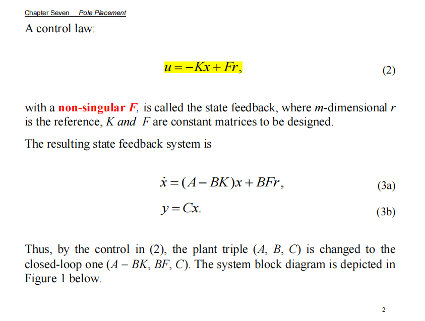
>    * 这里的 r 是参考输入或设定值，F 是前馈增益。Fr 项的作用是确保当 r 不为零时，系统的输出能够准确地跟踪这个设定值，并且通常能消除稳态误差。
>    * 在任务5中，您会看到我们确实需要处理一个非零的设定点 ($y_{sp} = [0.4, 0.8]^T$)，并且需要抑制扰动。那将是一个典型的伺服控制问题，届时 Fr
>      项（或其等效的积分控制结构）就会变得非常重要。
>      3* **<mark>知识支撑</mark>**
> * 第7章 §7.1 State Feedback (Page 1-2)：
>   
>   * Page 1给出了开环系统 ẋ = Ax + Bu。
>   * Page 2，公式(2)给出了一般形式的状态反馈控制律 u = -Kx + Fr。
>   * Page 2，公式(3a)展示了应用此控制律后，闭环系统的动态方程为 ẋ = (A-BK)x + BFr。
>   * 当 r=0 时，闭环系统变为 ẋ = (A-BK)x。此时，K 矩阵通过改变 A 矩阵的特征值（极点），来影响系统的稳定性和瞬态响应。
>   
>   所以，任务1的设计目标是在没有外部设定值输入的情况下，通过状态反馈 `u = -Kx`
>   来重新配置系统的极点，从而改善其从任意初始状态到零状态的瞬态响应性能。这正是极点配置技术最直接的应用场景之一。

* **要求**: 设计一个状态反馈控制器 u = -Kx，使得闭环系统在零设定值和零扰动下，从非零初始状态出发，其输出 y 的瞬态响应满足：超调量 M_p < 10% 且
    2%稳定时间 t_s < 20秒。同时，需要观察所有状态的响应和控制信号的幅值。

* **理论关联**: 这完全对应**第7章 (Chapter 7: Pole Placement)** 的内容。

### **步骤一：系统矩阵的确定与可控性检验**

1. 确定系统矩阵 (A, B, C)：
   
   * 思路：首先，根据您提供的学号参数 a=8, b=4, c=0, d=1，将其代入项目文件（Page 3，公式2）中给出的 A, B, C 矩阵的表达式。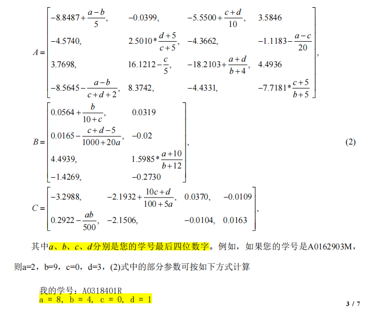
   * 推理：这是所有后续计算的基础。精确的数值矩阵是进行控制系统设计的第一步。
   * 程序运行结果：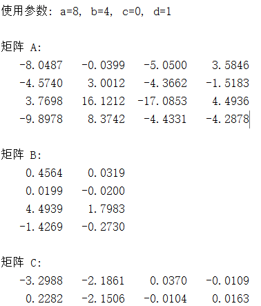

2. 检验系统的可控性：
   
   * 思路：构建系统的可控性矩阵 W_c，并计算其秩。
   * 推理：根据第7章（Page 21，定理1 / Slide Page），系统能够通过状态反馈任意配置极点的充要条件是系统是可控的。如果系统不可控，那么我们将无法将所有极点移动到我们期望的位置，任务目标就无法实现。
   * 方法：
     * 系统是4阶的（n=4），有2个输入（m=2）。
     * 可控性矩阵 W_c 的定义为 $W_c = [B, AB, A^2B, A^3B]$。这将是一个 n x (n*m)，即 4 x 8 的矩阵。
     * 计算 W_c 的秩。如果 $rank(W_c) = n$（即 $rank(W_c) = 4$），则系统可控。
   
   > 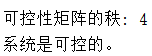
   
   ### **步骤二：确定期望的闭环极点位置**

3. 将性能指标转换为S平面区域：
   
   * 思路：利用二阶系统近似公式，将超调量和稳定时间的要求转换为S平面上极点必须满足的区域。
   
   * 推理：第7章（Page 11）提供了这些公式，它们是连接时域性能和频域（极点位置）特性的桥梁。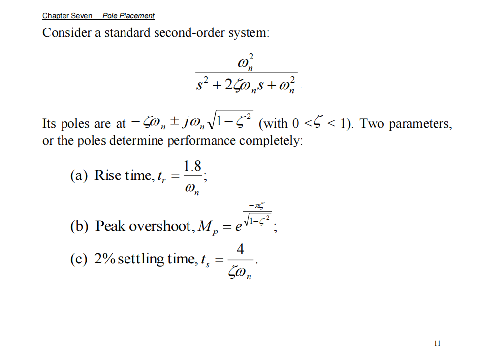
   
   * 方法：
     
     * 超调量 `M_p < 10%`：根据公式 $M_p = exp(-πζ / sqrt(1-ζ^2))$，解出 ζ（阻尼比）需要满足 ζ >0.59。这在S平面上对应一个以原点为顶点的锥形区域。
     
     * 2%稳定时间 `t_s < 20秒`：根据公式 t_s ≈ 4/(ζωn)，解出 ζωn（极点实部）需要满足 ζωn >0.2。这在S平面上对应一条垂直线，所有极点必须位于这条线的左侧。
     
     * 代码结果：
       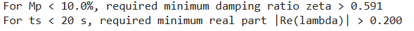
   
   >  <mark>实数极点与复数极点的区别</mark>
   > 
   > * 复数共轭极点：通常会导致系统响应出现振荡（超调），但如果阻尼比设计得当，可以实现较快的响应速度。它们由阻尼比 ζ 和自然频率 ωn 共同决定。
   > 
   > * 实数极点：会导致系统响应不振荡（无超调）。所有实数极点都会使系统处于过阻尼或临界阻尼状态，从而消除超调。响应速度由极点距离虚轴的远近（实部大小）决定，越负的实数极点，对应的响应模式衰减越快。
   >   根据项目要求：
   > 
   > * 超调量 Mp < 10% (要求 ζ > 0.591)
   > 
   > * 2%稳定时间 ts < 20秒 (要求 ζωn > 0.2)
   >   我为您建议以下四组期望的闭环极点 P_desired：
   > 1. `λ1,2 = -0.4 ± 0.4j` (主导复数共轭极点)
   >    
   >    * 理由：
   >      * 实部：Re(λ) = -0.4。对应的 ζωn = 0.4，大于 0.2，满足稳定时间要求。
   >      * 自然频率：$ω_n = sqrt((-0.4)^2 + (0.4)^2) ≈ 0.566 rad/s$。
   >      * 阻尼比：ζ = 0.4 / 0.566 ≈ 0.707。由于 0.707 大于 0.591，这满足了超调量小于10%的要求（实际超调量约为4.3%）。
   >      * 这对极点将提供一个具有适度超调的快速响应，通常能带来较好的上升时间。
   > 
   > 2. `λ3 = -1.2` (非主导实数极点)
   >    
   >    * 理由：一个较快的实数极点。其实部 |-1.2| = 1.2 远大于 0.4，且大约是主导极点实部 |-0.4|
   >      的3倍快。这确保了由该极点引起的响应模式会迅速衰减，不会对系统的主要动态产生显著影响。
   > 
   > 3. `λ4 = -2.0` (非主导实数极点)
   >    
   >    * 理由：最快的实数极点。其实部 |-2.0| = 2.0 远大于 0.4，且大约是主导极点实部 |-0.4|
   >      的5倍快。它将确保其对应的模式衰减最快，对系统响应的影响最小。
   >    
   >    最终建议的期望闭环极点集合为：
   >    P_desired = [-0.4 + 0.4j, -0.4 - 0.4j, -1.2, -2.0]

4. 选择四组期望的闭环极点 `P_desired`：
   
   * 思路：根据上述S平面区域的约束，选择两对共轭复数极点或四个实数极点（或混合），确保它们满足性能要求。
   * 推理：对于四阶系统，我们需要选择四个极点。通常会选择一对“主导极点”（dominant poles），它们决定了系统的主要响应特性，并将其放置在满足
     M_p 和 t_s 约束的边界附近。其余的“非主导极点”则选择得比主导极点更快（实部更负，通常是3-5倍），以确保它们对系统响应的影响较小。
   * 考虑因素：在选择极点时，还需要考虑控制信号的幅值。将极点放置得过于靠左（响应过快）可能会导致控制器输出过大，在实际系统中可能无法实现
   
   ### **步骤三：计算反馈增益矩阵 K (使用单位秩方法 Unity Rank K)**

5. 选择权重向量 `q`：
   
   * 思路：选择一个 m x 1（即 2 x 1）的非零向量 q，使得 (A, Bq) 对是可控的。
   
   * 推理：第7章 §7.4.1 Unity Rank K (Page 50-56) 介绍了单位秩方法。它通过将多输入系统 (A, B) 转换为一个等效的单输入系统 (A,Bq)，从而可以使用单输入系统的极点配置方法来求解。选择 q 的目的是确保这个等效的单输入系统仍然可控。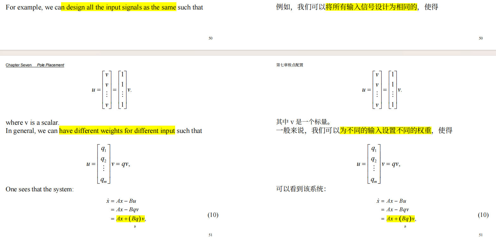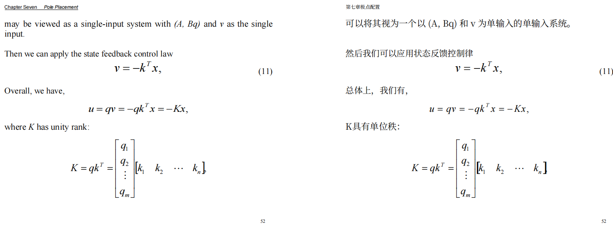
   
   * 方法：可以尝试简单的 q 向量，例如<mark> [1; 0] 或 [0; 1] 或 [1; 1]</mark>。对于每个 q，都需要检验 (A, Bq) 的可控性，即计算 $rank([Bq, A*Bq, A^2*Bq,
      A^3*Bq])$ 是否为4。
      x是四维（四个状态变量），那么q向量不应该也是四维吗?
     
     > 1. `q` 向量是用来组合系统输入的：
     > * 在单位秩方法 (Unity Rank Method)中，我们的核心思想是将多输入系统（MIMO）等效为一个单输入系统（SISO）。
     > 
     > * 原始系统有 m 个输入。在我们的发动机项目中，m=2（VGT和EGR阀门位置），所以<mark>输入 u 是一个 2 x 1 的向量</mark>。
     > 
     > * 我们引入一个新的标量输入 v。
     > 
     > * 然后，我们定义 u = q * v。
     > 
     > * <mark>为了让 u（2 x 1）等于 q 乘以 v（1 x 1），那么 q 必须是一个 2 x 1 的向量</mark>。
     > 2. 系统方程的转换：
     >    
     >    * 原始系统方程是 ẋ = Ax + Bu。
     >    * 当我们用 u = qv 代替 u 时，方程变为 ẋ = Ax + B(qv) = Ax + (Bq)v。
     >    * 现在，Bq 成为新的输入矩阵，而 v 是新的标量输入。
     >    * <mark>B 是 n x m 矩阵（4 x 2）。</mark>
     >    * <mark>q 是 m x 1 向量（2 x 1）。</mark>
     >    * 所以，Bq 的结果是一个 n x 1 向量（4 x 1）。这个 4 x 1 的向量就是我们等效的单输入系统中的 b_new 向量。
     > 
     > 3. 可控性检验的维度：
     >    
     >    * 对于这个等效的单输入系统 (A, Bq)，其可控性矩阵是 [Bq, A*Bq, A^2*Bq, A^3*Bq]。
     >    * Bq 是 4 x 1 的向量。
     >    * A*Bq 也是 4 x 1 的向量。
     >    * 因此，可控性矩阵 [Bq, A*Bq, A^2*Bq, A^3*Bq] 是一个 4 x 4 的方阵。我们检验它的秩是否为 n=4。
     > 
     > 总结：q 向量的维度取决于系统输入的数量 `m`，而不是状态变量的数量 n。在我们的项目中，m=2，所以 q是一个2维向量。它起到了将多个输入“加权组合”成一个单一输入的作用，从而将多输入系统转化为单输入系统进行极点配置。

6. 计算等效单输入反馈增益 `k_siso`：
   
   * 思路：对可控的单输入系统 (A, Bq)，计算一个 1 x n（即 1 x 4）的反馈增益向量 k_siso，使得 eig(A - Bq * k_siso) = P_desired。
     
     > 核心是求解一个线性代数问题，使得闭环系统的特征多项式与我们期望的特征多项式完全一致。第7章（Pole
     >   Placement）详细介绍了如何实现这一点。
     >   对于一个可控的单输入系统 (A, Bq)，我们希望找到一个 1 x n 的反馈增益向量 k_siso，使得闭环系统 $(A - Bq * k_{siso}^T)$
     >   的特征值（极点）是我们预先设定的 P_desired。
     >   在第7章 §7.3 Single-input Case (Page 20-34) 中，有两种主要的方法可以实现：
     > 
     > 1. 直接比较法 (Direct Comparison Method)：
     >    
     >    * 思路：这种方法基于闭环系统的特征多项式 det(sI - (A - Bq * k_siso^T)) 必须等于我们期望的特征多项式 φ_d(s)。
     >    * 步骤：
     >      1. 首先，计算出闭环系统矩阵 A_cl = A - Bq * k_siso^T。请注意，k_siso^T 是一个行向量，Bq 是一个列向量，它们的乘积 Bq * k_siso^T
     >         是一个 n x n 的矩阵。
     >      2. 然后，计算 det(sI - A_cl)，这将得到一个以 s 为变量，且系数中包含 k_siso 各元素的 n 阶多项式。
     >      3. 同时，根据我们选择的期望极点 P_desired，构建期望的特征多项式 φ_d(s) = (s - λ1)(s - λ2)...(s - λn)。
     >      4. 最后，比较这两个多项式中 s 的同次幂项的系数。这将得到一个包含 n 个线性方程的方程组，未知数就是 k_siso 的 n
     >         个元素。解这个方程组即可得到 k_siso。
     >    * 局限性：第7章（Page 29）指出，当系统阶数 n 较高（例如 n=4）时，手动展开行列式并求解方程组会非常繁琐和困难。
     > 
     > 2. Ackermann 公式 (Ackermann's Formula)：
     >    
     >    * 思路：这是一种更系统化、更直接的方法，尤其适用于高阶系统。
     >    * 公式：第7章（Page 30）给出了Ackermann公式：
     >      $k_{siso}^T = [0, 0, ..., 0, 1] * Wc_{siso}^{-1} * φ_d(A)$
     >    * 步骤：
     >      1. 计算 `Wc_siso`：这是针对单输入系统 (A, Bq) 的可控性矩阵，即 Wc_siso = [Bq, A*Bq, A^2*Bq, A^3*Bq]。
     >      2. 计算 `Wc_siso^(-1)`：求出 Wc_siso 的逆矩阵。
     >      3. 计算 `φ_d(A)`：将期望的特征多项式 φ_d(s) 中的 s 替换为矩阵 A，常数项替换为 I（单位矩阵）。例如，如果 φ_d(s) = s^n + γ_(n-1)s^(n-1) + ... + γ_1s + γ_0，那么 φ_d(A) = A^n + γ_(n-1)A^(n-1) + ... + γ_1A + γ_0I。
     >      4. 代入公式：将上述结果代入Ackermann公式，即可直接计算出 k_siso^T。
     >    * 优点：这种方法避免了复杂的方程组求解，直接给出了 k_siso。
     >    
     >    总结：
     >    在实际操作中，尤其是对于4阶系统，我们通常会选择使用Ackermann公式，因为它更具通用性和计算效率。当然，在MATLAB等工具中，这些计算都已经被封装
     >    在 place 或 acker 等函数中，我们只需提供 A、Bq 和 P_desired 即可直接获得 k_siso。
   
   * 推理：一旦将MIMO问题转化为SISO问题，就可以使用成熟的SISO极点配置算法（如Ackermann公式或MATLAB的 place 函数）来计算 k_siso。

7. 构建最终的MIMO反馈增益矩阵 `K`：
   
   * 思路：将 q 和 k_siso 组合，得到 m x n（即 2 x 4）的 K 矩阵。
   * 推理：根据第7章（Page 56，公式12），最终的反馈增益矩阵 K 为 K = q * k_siso。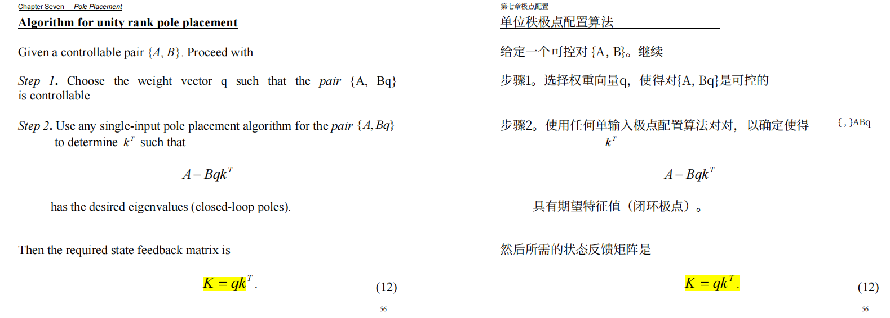
   
   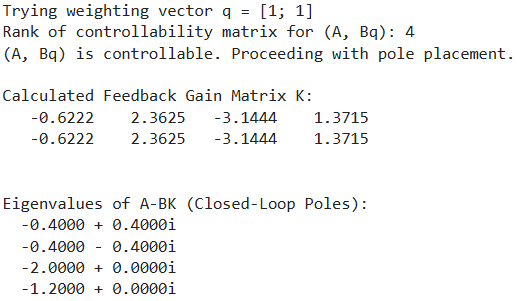
   
   ### **步骤四：仿真与性能分析**

8. 构建闭环系统模型：
   
   * 思路：使用计算出的 K 矩阵，构建闭环状态空间模型 sys_cl = ss(A-BK, B, C, 0)。
     
     > <mark>详细解释一下“构建闭环系统模型 sys_cl = ss(A-BK, B, C, 0)”这一步的含义。</mark>
     >   理解闭环系统模型 `sys_cl = ss(A-BK, B, C, 0)`
     >   我们从原始的开环系统和您设计的控制律开始：
     > 
     > 1. 原始开环系统：
     >    
     >    * 状态方程：ẋ = Ax + Bu
     >    * 输出方程：y = Cx + Du (在我们的项目中，D 矩阵为零，所以 y = Cx)
     > 
     > 2. 任务1的控制律：
     >    
     >    * u = -Kx (因为任务1假设设定值 r=0，所以 Fr 项为零)
     >    
     >    现在，我们将控制律 u = -Kx 代入原始系统的状态方程：
     > * ẋ = Ax + B(-Kx)
     > 
     > * ẋ = Ax - BKx
     > 
     > * ẋ = (A - BK)x
     >   这就是闭环系统的状态方程。它描述了在状态反馈控制器作用下，系统状态 x 如何随时间演变。
     > 
     > * 新的系统矩阵：A_cl = (A - BK)。这是闭环系统最核心的变化，它决定了闭环系统的极点位置和动态特性。
     > 
     > * 输出矩阵：C_cl = C。输出方程没有改变。
     > 
     > * 直通矩阵：D_cl = 0。直通矩阵也没有改变。
     >   关于 `B` 矩阵的含义
     >   现在，关键在于 ss(A_cl, B_cl, C_cl, D_cl) 中的 B_cl 应该是什么。
     > 1. 对于“非零初始状态和零外部输入下的响应”：
     >    
     >    * 如果严格按照 u = -Kx 且没有外部输入（即 r=0），那么闭环系统是 ẋ = (A - BK)x。
     >    * 在这种情况下，闭环系统没有外部输入。在MATLAB中，通常会用 ss(A_cl, [], C_cl, []) 或 ss(A_cl, zeros(n,0), C_cl, zeros(p,0))
     >      来表示一个没有输入的系统，只用于仿真初始条件响应。
     > 
     > 2. 对于“检查阶跃响应”：
     >    
     >    * 任务1虽然假设“设定值可以假设为零”，但同时又要求“检查阶跃响应”。这通常指的是检查系统对参考输入 `r` 的阶跃变化的响应。
     >    * 为了在闭环系统中引入参考输入 r 进行阶跃响应测试，我们通常会考虑更一般的控制律形式 u = -Kx + Fr。
     >    * 在任务1的语境下，如果 F 没有被明确设计，但我们仍要测试对参考输入 r 的阶跃响应，那么通常会隐式地假设 `F` 为单位矩阵 `I`。
     >    * 在这种情况下，控制律变为 u = -Kx + r。
     >    * 将其代入原始系统状态方程：
     >      * ẋ = Ax + B(-Kx + r)
     >      * ẋ = (A - BK)x + Br
     >    * 此时，闭环系统就有了外部输入 r，其输入矩阵就是原始的 B 矩阵。
     >    
     >    因此，`sys_cl = ss(A-BK, B, C, 0)` 这种写法，是为了在MATLAB中方便地表示一个闭环系统，它允许我们：
     > * 仿真初始条件响应：此时 B 矩阵虽然存在，但外部输入 r 设为零，所以 Br 项为零，系统行为由 (A-BK)x 决定。
     > 
     > * 仿真阶跃响应：此时将阶跃信号作为外部输入 r 施加给系统，通过 Br 项影响状态，从而观察闭环系统对参考输入的跟踪能力（即使在任务1中我们不设计
     >   F 来优化跟踪性能）。
     >   简而言之，A-BK 是闭环系统的核心动态矩阵，而 B 矩阵在这里作为外部参考输入 `r` 进入闭环系统的通道。
   
   * 推理：这是我们设计的控制器作用于原系统后的最终模型，所有性能分析都将基于此模型。

9. 阶跃响应仿真：
   
   * 思路：对闭环系统施加阶跃输入，观察输出 y 和状态 x 的响应。
   * 推理：项目要求检查阶跃响应。由于是MIMO系统，我们需要对每个输入通道单独施加阶跃信号（例如，r = [1; 0] 和 r = [0;1]），并观察所有输出的响应。
   * 分析：检查 y 的响应是否满足 M_p < 10% 和 t_s < 20秒 的要求。

10. 非零初始状态响应仿真：
    
    * 思路：在零外部输入 (r=0) 的情况下，仿真系统从给定的非零初始状态 $x_0 = [0.5, -0.1, 0.3, -0.8]^T$ 出发的响应。
    * 推理：这是调节问题的典型场景，我们需要观察所有四个状态变量 x1, x2, x3, x4 如何随时间变化并收敛到零。

11. 控制信号幅值监测：
    
    * 思路：在上述仿真过程中，记录并分析控制信号 u = -Kx 的幅值。
    * 推理：在实际工程中，执行器（VGT和EGR阀）的输出能力是有限的。如果 u 的幅值过大，超出了执行器的物理限制，那么即使理论上性能再好，这个控
      制器也是不可用的。这可能需要我们重新评估期望的极点位置，在性能和控制成本之间进行权衡。

---

## **任务 2: LQR 最优控制器** - chapter 8

任务原文要求：Assume that you can measure all the four state variables, design a state feedback controller using the LQR method, simulate the designed system, check the step responses and show all the state responses to non-zero initial state with zero external inputs. Discuss effects of weightings Q and R on system performance, and also monitor control signal size. In this step, both the disturbance and set point can be assumed to be zero. (15 points)

1. **任务目标与LQR思想**
   任务二要求我们使用LQR方法设计一个状态反馈控制器 u = -Kx，并重点讨论权重矩阵 Q 和 R 对系统性能的影响。
   与任务一中我们“强行”指定极点位置不同，LQR是一种更“优雅”的最优控制方法。它的核心思想是在系统性能（响应速度、误差大小）和控制成本（能量消耗
   ）这对固有矛盾之间，寻找一个最佳的权衡（best trade-off） (参考 Chapter 8, Slide 4)。
   这种权衡是通过最小化一个二次型代价函数 (Cost Function) 来数学化实现的 (参考 Chapter 8, Slide 6, Eq. 2):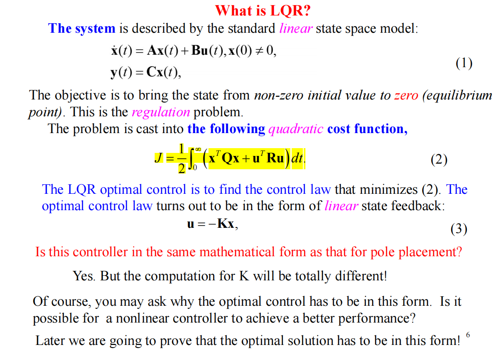
   
   $$
   J = \frac{1}{2}\int_{0}^{\infty} (x^T Q x + u^T R u) dt
   $$
   
   * $x^T Q x$ (状态惩罚项): 衡量了系统状态 x 偏离零点（平衡点）的代价。
   * $u^T R u$ (控制输入惩罚项): 衡量了使用控制输入 u 的代价。
   
   LQR的目标就是找到一个反馈增益 K，使得在这个 K 的作用下，总代价 J 达到最小值。
   

2. **如何完成任务二：详细设计流程**
   
   ### 步骤 2.1：LQR问题求解的理论基础
   
   * 思路: LQR理论提供了一个求解最优反馈增益 K 的标准方法。这个 K 并非凭空而来，而是通过求解一个关键的矩阵方程得到的。
   
   * 理论支撑:
     
     1. 代数黎卡提方程 (Algebraic Riccati Equation, ARE): 这是LQR问题的核心。我们需要求解一个唯一的、对称半正定的矩阵 P，它满足以下方程 (参考
         Chapter 8, Slide 38):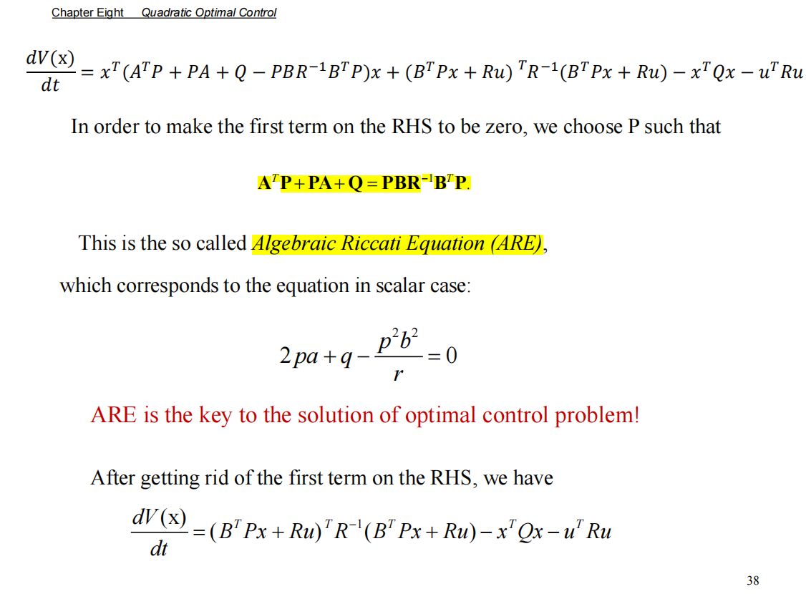
        
        $$
        A^TP + PA - PBR^{-1}B^TP + Q = 0
        $$
     
     2. 最优反馈增益 (Optimal Feedback Gain): 一旦解出矩阵 P，最优的反馈增益 K 就可以直接计算得出 (参考 Chapter 8, Slide 40):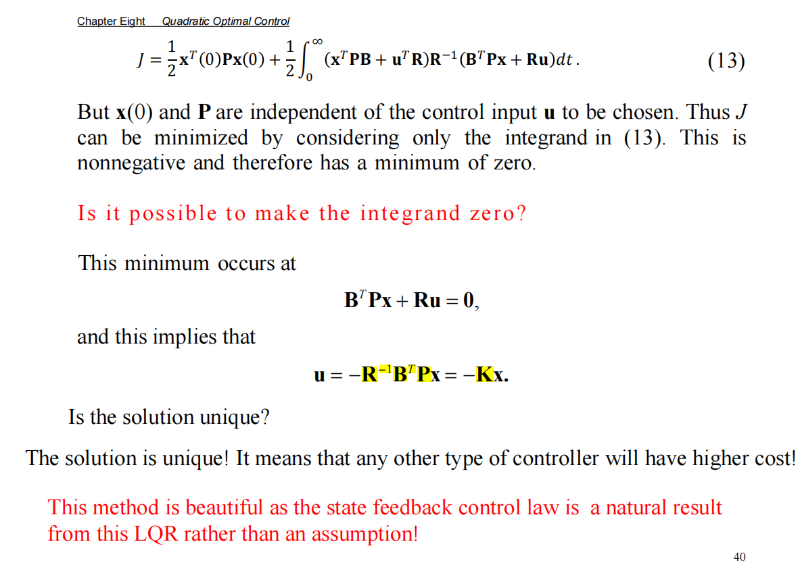
        
        $$
        K = R^{-1}B^TP
        $$
   
   * 方法: 在MATLAB中，我们无需手动求解复杂的ARE方程。lqr 函数 K = lqr(A, B, Q, R) 封装了整个求解过程，是完成此步骤的直接工具。
     ARE方程求解：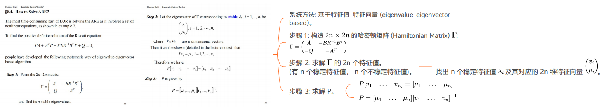
   
   ### 步骤 2.2：选择权重矩阵 Q 和 R (设计的艺术与核心)
   
   这是任务二的精髓，因为它体现了控制工程师如何将抽象的性能要求转化为具体的数学参数。
   
   * 思路: 通过试凑法（trial-and-error）和对 Q、R 物理意义的理解，迭代调整这两个矩阵，直到闭环系统的性能满足要求。
   
   * 理论指导 (参考 Chapter 8, Slide 46-47):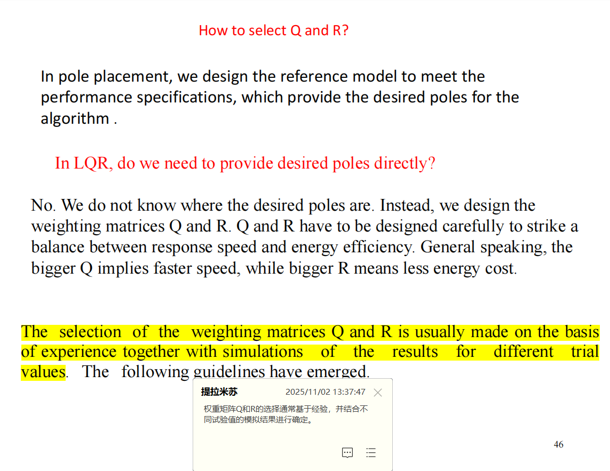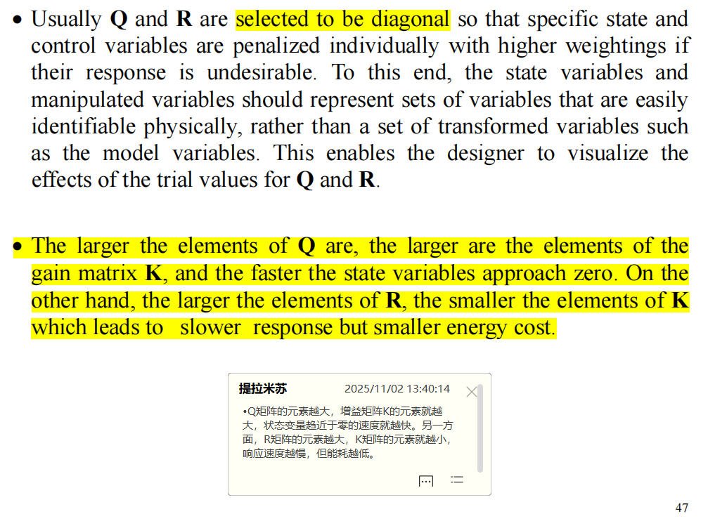
     
     * `Q` 和 `R` 的结构: 通常选择为对角矩阵，这样可以独立地对每个状态变量的误差和每个控制输入的大小进行加权。
       * Q = diag([q1, q2, q3, q4])
       * R = diag([r1, r2])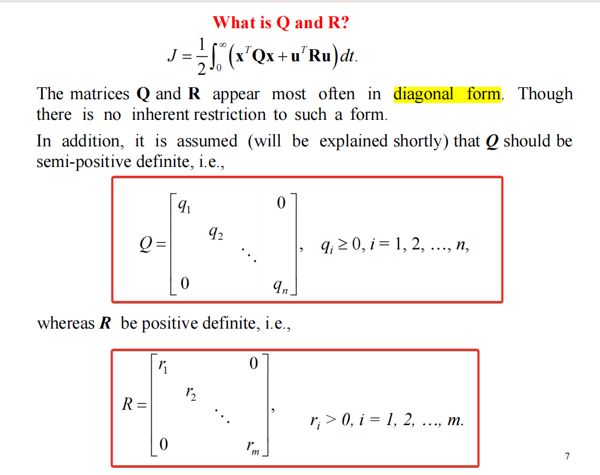
     * `Q` 和 `R` 的性质: Q 必须是半正定矩阵 (Q >= 0)，R 必须是正定矩阵 (R > 0)，以保证代价函数有意义且控制信号有界 (参考 Chapter 8, Slide 7,
       21, 23)。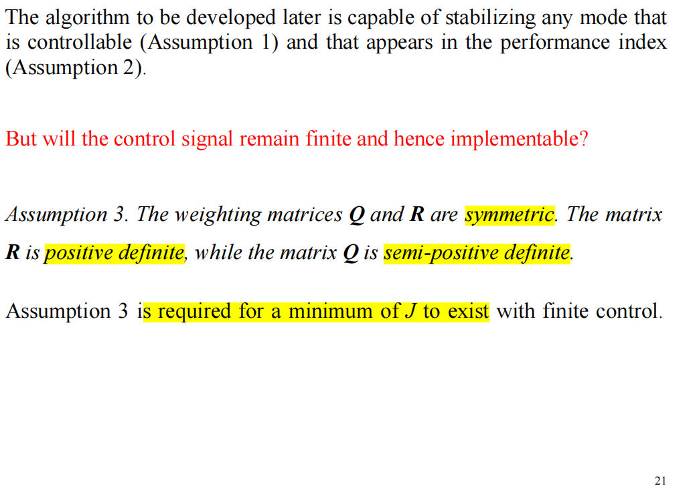
   
   * 迭代调整与讨论的策略:
     
     1. 设定初始值: 一个很好的起点是基于输出进行加权。因为我们最终关心的是输出 y，所以可以将状态惩罚 $x^T Q x$ 与输出惩罚 $y^T y$ 关联起来。由于
        $y = Cx$，我们有 $y^T y = x^T C^T C x$。因此，一个合理的初始选择是 $Q = C' * C$。对于控制惩罚，可以从 $R = I$ (单位矩阵)
        开始，这意味着对两个控制输入（VGT和EGR）的惩罚是均等的。
     
     > <mark>Q = C' * C中的C'是什么意思</mark>
     >  在MATLAB的语境中，以及在控制理论的文献中，当处理实数矩阵时，**C' 通常指的是矩阵的转置 (Transpose)**。
     >   详细解释
     > 
     > 1. 矩阵转置 (Transpose)：
     >    
     >    * 一个矩阵的转置，就是将其行和列互换。如果原始矩阵 C 的维度是 m x n，那么它的转置 C^T（在数学上通常用 T 上标表示）的维度就是 n x m。
     >    * 在我们的项目中，C 矩阵的维度是 2 x 4。
     >    * 因此，C' (即 C^T) 的维度就是 4 x 2。
     > 
     > 2. 为什么是 `Q = C' * C`：
     >    
     >    * 我们来检查一下矩阵乘法的维度：
     >      * C' 的维度是 4 x 2。
     >      * C 的维度是 2 x 4。
     >      * 所以，C' * C 的结果是一个 (4x2) * (2x4) = 4x4 的矩阵。
     >    * 这与状态惩罚矩阵 Q 的维度（必须是 n x n，即 4 x 4）完全匹配。
     > 
     > 3. 物理和数学意义：
     >    
     >    * 代价函数中的状态惩罚项是 x' * Q * x。
     >    * 如果我们选择 Q = C' * C，那么这一项就变成了 x' * (C' * C) * x。
     >    * 根据矩阵乘法律，这可以重写为 (C * x)' * (C * x)。
     >    * 我们知道，系统的输出 y = C * x。
     >    * 所以， (C * x)' * (C * x) 其实就是 y' * y，也就是输出向量 y 的欧几里得范数的平方 (||y||^2)。
     >    * 结论：选择 Q = C' * C 意味着我们不直接惩罚那四个没有物理意义的状态变量 `x`，而是直接惩罚我们关心的、有物理意义的输出
     >      `y`。我们希望输出 y（即AFR和EGR率）尽快回到零，所以我们把对 y 的惩罚作为代价函数的一部分。这是一种非常常见且直观的LQR权重选择方法。
     > 
     > 4. R = eye(2) 是什么意思？
     >    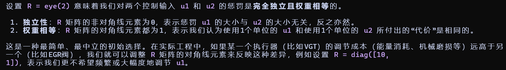
     
     1. 分析与调整 (讨论的核心内容):
        * 场景一：响应太慢 (稳定时间不满足 < 20s)。
          * 原因: 对控制输入的惩罚 R 可能过高，或者对状态误差的惩罚 Q 不足。
          * 措施: 增大 $Q/R$ 的比值。可以尝试减小 R (例如 $R = 0.1*I$ 或 $R =
            0.01*I$)，这相当于“放松”了对控制能量的限制，允许控制器使用更大的力气。或者，增大 Q (例如 $Q = 10 *
            C'*C$)，告诉控制器“我更不能容忍状态误差”。
        * 场景二：超调太大或控制信号 `u` 峰值过高。
          * 原因: 控制器过于“激进”，对状态误差的反应过于灵敏。
          * 措施: 减小 $Q/R$ 的比值。可以尝试增大 R (例如 $R = 10*I$)，这相当于增加了控制成本，迫使控制器动作更“温和”。
     2. 记录与讨论: 您需要在报告中清晰地展示至少2-3组不同的 Q 和 R 组合及其对应的仿真结果（阶跃响应图和控制信号图）。然后，必须详细讨论这些变
        化如何导致了性能（响应速度、超调）和成本（控制信号幅值）之间的权衡，这直接对应了幻灯片Slide 4和Slide 47所阐述的核心思想。
   
   ### 步骤 2.3：最终验证
   
   * 思路: 当找到一组满意的 Q 和 R 后，进行最终的仿真验证，以证明其满足所有任务要求。
   * 方法:
     1. 使用最终计算出的 K 构建闭环系统 $sys_{cl-lqr} = ss(A-B*K, B, C, 0)$。
     2. 运行阶跃响应仿真，并从图中量化超调和稳定时间，确保它们满足 Mp < 10% 和 ts < 5s。
     3. 运行初始状态响应仿真，展示所有四个状态变量 x 和两个控制输入 u 的曲线。
     4. 将这些图表和最终选择的 Q, R 以及计算出的 K 矩阵作为任务二的最终设计成果。

---

## 任务 3: 基于观测器的 LQR 控制 (Observer-based LQR Control) -- chapter 11 + chapter 8

## 1. 任务目标与背景

**原文要求**: "Assume you can only measure the two outputs. Design a state observer, simulate the resultant observer-based LQR control system, monitor the state estimation error, investigate effects of observer poles on state estimation error and closed-loop control performance. In this step, both the disturbance and set point can be assumed to be zero."

**核心解读**:

* **冗余性分析**: 系统状态 $n=4$，输出 $m=2$。由于 $rank(C)=2$ (通常假设)，说明有 2 个状态分量可以通过 $y$ 直接计算得到。

* **新目标**: 设计一个 **2 阶 (n-m)** 的降维观测器来估计剩余的状态动态。

* **最终输出**: 利用测量输出 $y$ 和观测器状态 $\xi$ 重构全维状态 $\hat{x}$，用于 LQR 反馈 $u = -K\hat{x}$。

## 2. 核心理论 (基于 Chapter 11 Slide 49-67)

### 2.1 为什么选择降维观测器？(Slide 49)

* 利用已知的 $m$ 个输出变量，只对剩下的 $n-m$ 个状态进行估计。

* 减少计算负担，避免对已知信息的重复（且可能引入误差的）估计。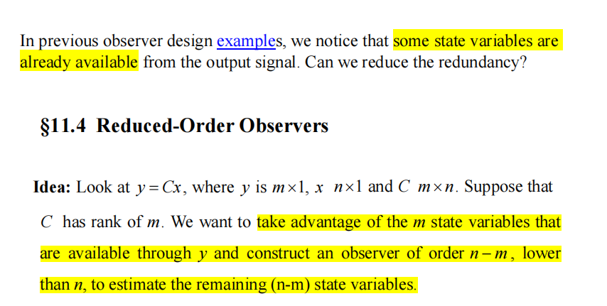

### 2.2 构造原理 (Slide 53)

我们要寻找一个变换矩阵 $T \in \mathbb{R}^{2 \times 4}$，构造一个新的 2 维状态向量 $\xi = Tx$。

观测器动态方程为：

$\dot{\xi} = D\xi + Eu + Gy$

其中 $\xi \in \mathbb{R}^2$ 是观测器状态，不是物理状态。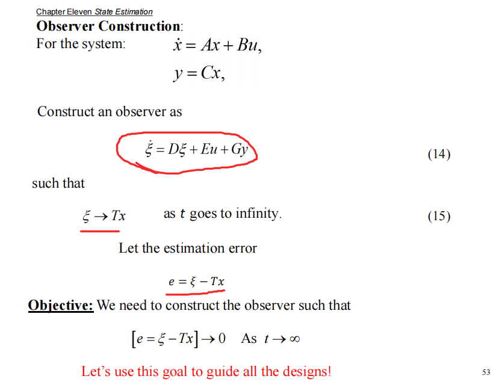

### 2.3 误差动态与设计方程 (Slide 55-56)

定义估计误差 $e = \xi - Tx$。

误差动态为 $\dot{e} = De + (DT - TA + GC)x + (E - TB)u$。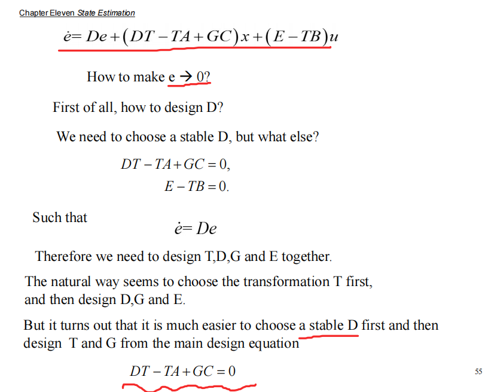

为了使误差 $e(t) \to 0$，必须满足以下条件：

1. **稳定性**: Matrix $D$ (2x2) 必须稳定（特征值实部为负）。

2. **设计方程 (Sylvester Equation)**: $TA - DT = GC$。

3. **输入匹配**: $E = TB$。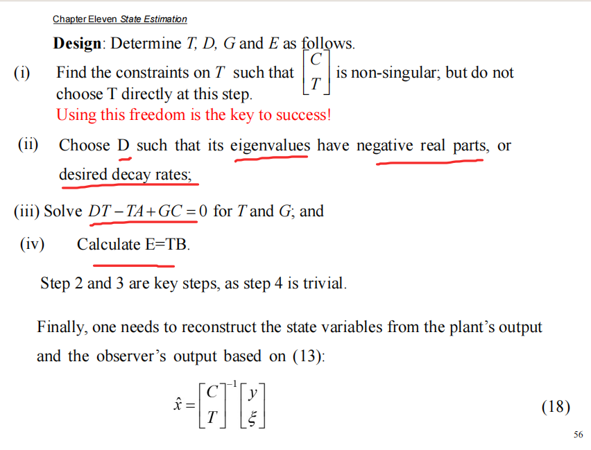

### 2.4 状态重构 (Slide 50, 56)

一旦得到 $\xi$，结合测量值 $y$，我们可以通过逆变换求得全维状态 $\hat{x}$：

$\begin{bmatrix} y \\ \xi \end{bmatrix} = \begin{bmatrix} C \\ T \end{bmatrix} x \implies \hat{x} = \begin{bmatrix} C \\ T \end{bmatrix}^{-1} \begin{bmatrix} y \\ \xi \end{bmatrix}$

关键约束: 矩阵 $\begin{bmatrix} C \\ T \end{bmatrix}$ 必须是可逆的（非奇异）。

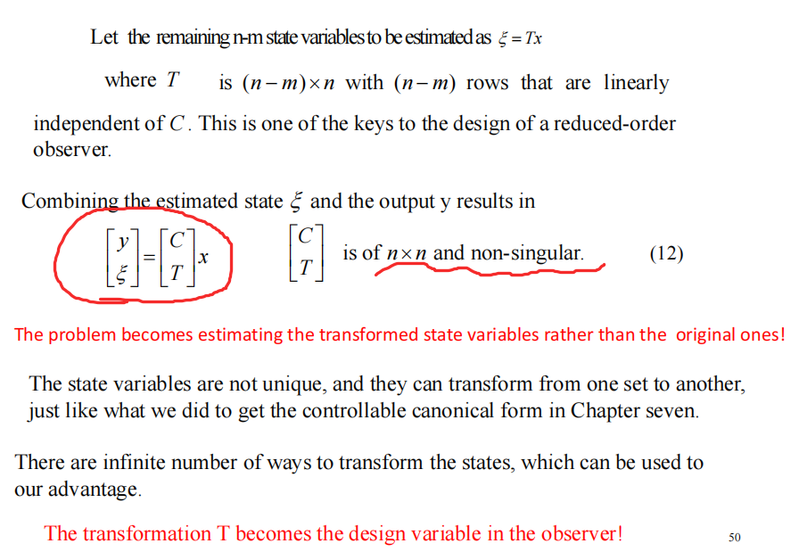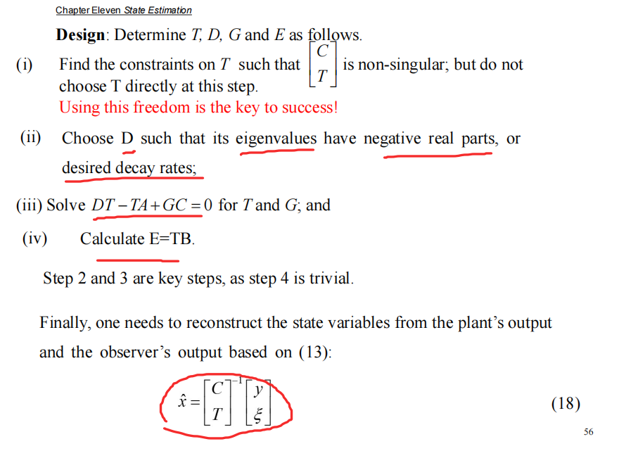

## 3. 执行步骤指南 (Step-by-Step)

### 步骤 3.1：系统检验与准备

1. **获取 LQR 增益**: 复用任务 2 的反馈增益 $K$。

2. **秩检验**: 确认 $rank(C) = 2$。

### 步骤 3.2：降维观测器设计 (Investigation 核心)

为了满足题目 "Investigate effects of observer poles" 的要求，我们需要设计三组不同的观测器参数。重点在于选择矩阵 $D$ 的特征值（即观测器极点）。

* **设计变量选择**:
  
  * **矩阵 D**: 选择为对角矩阵 $D = \text{diag}(\lambda_1, \lambda_2)$。
  
  * **矩阵 G**: 可以选择为简单的矩阵（如全 1 或单位阵），只要能保证解出的 $T$ 满足可逆性条件即可。如果解出的 $T$ 不好，再调整 $G$。

* **三组对比实验**:
  
  * **Case A (Slow)**: $\lambda_{1,2} \approx$ LQR 主导极点。
  
  * **Case B (Recommended)**: $\lambda_{1,2} \approx 3 \sim 5 \times$ LQR 主导极点。
  
  * **Case C (Fast)**: $\lambda_{1,2} \approx 10 \times$ LQR 主导极点。

### 步骤 3.3：求解参数矩阵 (T, E, M)

对于每一组 Case，执行以下计算：

1. **设定 D**: 根据选定的极点构造 2x2 对角阵。

2. **设定 G**: 建议尝试 $G = \begin{bmatrix} 1 & 0 \\ 0 & 1 \end{bmatrix}$ 或其他简单数值。

3. **求解 T**: 解线性方程组 $T A - D T = G C$。
   
   * 这是一个关于 $T$ 的线性方程组（Sylvester 方程）。在 MATLAB 中可以使用 `sylvester` 函数求解，方程形式为 $AT + TB = C$，需变形为 $T A + (-D) T = G C$。即 `T = sylvester(-D, A, G*C)` (注意 MATLAB `sylvester(A,B,C)` 解 $AX + XB = C$，这里的对应关系需仔细查阅文档，通常 $A_{syl} X + X B_{syl} = C_{syl}$，这里是 $X A_{sys} - D X = GC$，可能需要转换形式或直接把元素展开解线性方程组)。
   
   * _更稳妥的方法_: 将 $T$ 的元素展开，写成 $Ax=b$ 的形式求解。

4. **计算 E**: $E = T B$。

5. **计算重构矩阵 M**: $M = \begin{bmatrix} C \\ T \end{bmatrix}^{-1}$。如果不可逆，返回第 2 步修改 $G$。

### 3.4 仿真实现 (Critical Implementation Details)

在 Simulink 或代码中，系统逻辑如下：

1. 真实系统:
   $\dot{x} = A x + B u，$y = C x$

2. 降维观测器:
   $\dot{\xi} = D \xi + E u + G y$，$\text{Initial Condition } \xi(0): \text{Set to } [0; 0] \text{ or consistent with } \hat{x}(0)=0$

3. 状态重构与控制器:
   $\hat{x} = M \times \begin{bmatrix} y \\ \xi \end{bmatrix}$，$u = -K \hat{x}$

## 4. 结果分析与报告撰写要点

### 4.1 绘图要求

对于每一组 (Case A, B, C)：

1. **状态跟踪图**: 绘制 $x(t)$ 和 $\hat{x}(t)$。由于 $x$ 有 4 维，建议选 2 个代表性状态（例如 $x_2$ 和 $x_4$）展示跟踪效果。
   
   * _注意_: 对于降维观测器，其中 2 个状态（与 $y$ 相关的）是完全重合的（或者是代数计算出来的），另外 2 个状态是动态估计的。观察这一点非常有趣。

2. **估计误差图**: 绘制误差范数 $\|x(t) - \hat{x}(t)\|$。

3. **控制输入图**: 绘制 $u(t)$。

### 4.2 讨论核心

* **降维优势**: 强调只需要积分 2 个状态，计算量小。

* **极点影响**: 同样的，分析慢极点导致的收敛滞后和快极点可能导致的初始峰值（Peaking）。

* **直接测量的状态**: 指出 $\hat{x}$ 中由 $y$ 直接计算的部分是没有动态滞后的（理论上），这比全维观测器（所有状态都有滞后）更优越。

* * *

## 任务4：decoupling design -- chapter 10

1. 任务目标与要求 (Task Objectives & Requirements)
   任务原文要求：Design a decoupling controller with closed-loop stability and simulate the step response of the resultant control system to verify decoupling performance with stability. In this question, the disturbance can be assumed to be zero. Is the decoupled system internally stable? Please provide both the step (transient) response with zero initial states and the initial response with respect to $𝑥_0$ of the decoupled system to support your conclusion.
   
   

根据项目文件 `Mini-project-2025.pdf` (Page 5, Task 4)，本任务的核心要求如下：

1. **设计解耦控制器 (Design a Decoupling Controller):**
   
   * 目标是实现输入输出解耦，即控制输入 $r_1$ 只影响输出 $y_1$，控制输入 $r_2$ 只影响输出 $y_2$。这意味着闭环传递函数矩阵 $H(s)$ 必须是对角矩阵。

2. **闭环稳定性 (Closed-loop Stability):**
   
   * 这是关键约束。简单的积分器解耦（Integrator Decoupling，即传递函数为 $1/s^k$）会导致系统极点位于原点（临界稳定），这**不符合**项目要求的“闭环稳定性”。
   
   * 因此，必须使用**带极点配置的解耦技术 (Decoupling with Pole Placement)**，将闭环极点配置在左半平面。

3. **验证 (Verification):**
   
   * **阶跃响应 (Step Response):** 假设初始状态为零，验证解耦效果（对角线响应正常，非对角线响应为零）和稳定性。
   
   * **零输入响应 (Initial Response):** 假设输入 $r=0$，初始状态 $x_0 = [0.5, -0.1, 0.3, -0.8]^T$（项目文件 Page 4），验证系统状态是否收敛到零。

4. **分析问题:**
   
   * 解耦后的系统是**内部稳定 (Internally Stable)** 的吗？需要结合仿真结果和理论分析（查看闭环特征值）来回答。

* * *

2. 理论基础与课件索引 (Theoretical Basis & Chapter 10 Mapping)

本任务主要对应 **Chapter 10: Decoupling Control** 的内容，特别是 **Theorem 2**。

### 2.1 相对阶 (Relative Degree) $\sigma_i$

* **概念:** 输出 $y_i$ 对输入 $u$ 的“距离”或延迟阶数。

* **计算:** 查找最小的整数 $\sigma_i$，使得 $c_i^T A^{\sigma_i-1} B \neq 0$。
  
  * 先算 $c_i^T B$。若非零，$\sigma_i=1$。
  
  * 若为零，算 $c_i^T A B$。若非零，$\sigma_i=2$。

* **课件索引:** `Chapter10_Slide.pdf`, **Page 29-33**。

* 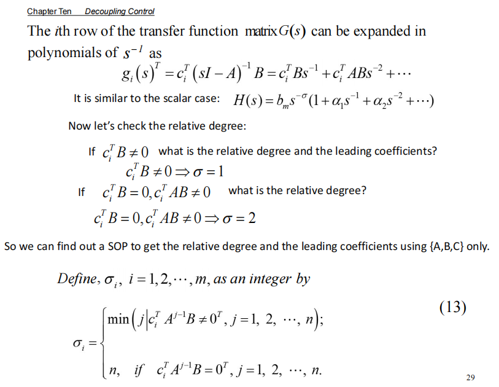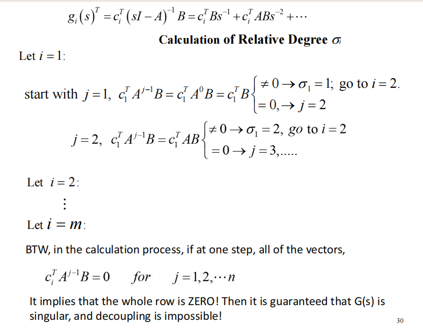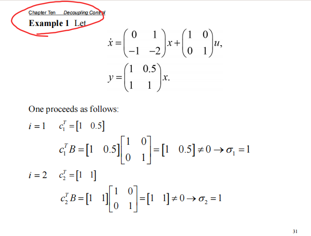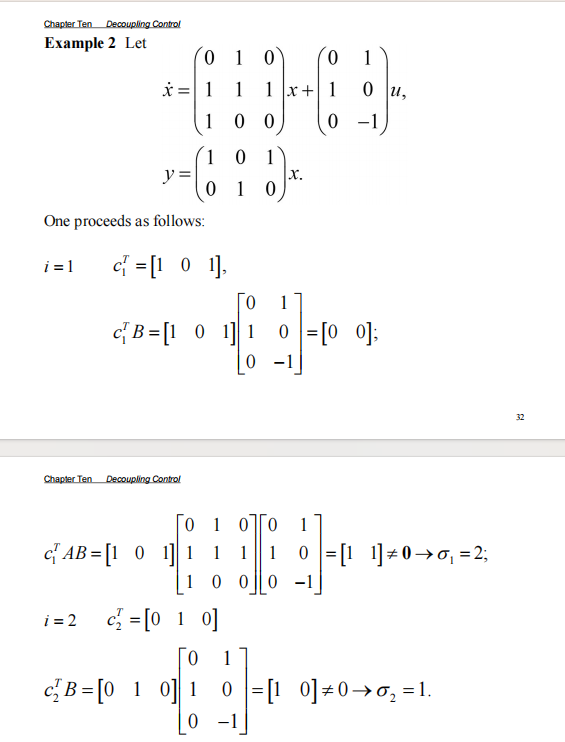

### 2.2 解耦矩阵 $B^*$ (Decoupling Matrix)

* **定义:**
  $B^* = \begin{bmatrix} c_1^T A^{\sigma_1-1} B \\ c_2^T A^{\sigma_2-1} B \\ \vdots \\ c_m^T A^{\sigma_m-1} B \end{bmatrix}$

* **解耦条件:** 系统可解耦的充要条件是 $B^*$ **非奇异 (Non-singular)**，即 $\det(B^*) \neq 0$。

* **课件索引:** `Chapter10_Slide.pdf`, **Page 36-37 (Theorem 1)**。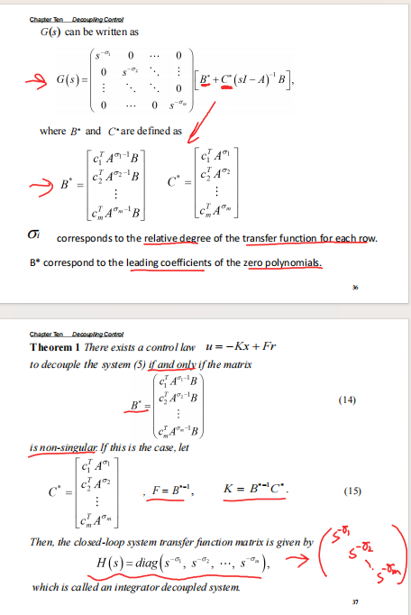

### 2.3 带稳定性的解耦控制 (Theorem 2: Decoupling with Stability) - **核心算法**

由于任务要求稳定性，我们不能只用 Theorem 1（积分器解耦）。我们需要 **Theorem 2**。

* 目标闭环传递函数: 我们希望闭环传递函数 $H(s)$ 为对角阵，且每个对角元素都是稳定的传递函数：
  $H(s) = \text{diag}\left( \frac{1}{\phi_{f_1}(s)}, \frac{1}{\phi_{f_2}(s)} \right)$
  (注：如果需要稳态增益为 1，分子需要乘以前馈增益，但这不影响解耦性质)

* **多项式设计 $\phi_{f_i}(s)$:**
  
  * $\phi_{f_i}(s)$ 是一个阶数为 $\sigma_i$ 的**稳定**多项式。
  
  * 例如，如果 $\sigma_1 = 1$，选 $\phi_{f_1}(s) = s + \lambda$ ($\lambda > 0$)。
  
  * 例如，如果 $\sigma_1 = 2$，选 $\phi_{f_1}(s) = (s + \lambda_1)(s + \lambda_2)$。

* **控制器参数计算:**
  
  * 前馈增益 $F$:
    $F = (B^*)^{-1}$
  
  * 反馈增益 $K$:
    $K = (B^*)^{-1} C^{**}
    其中 $C^{**} (课件中写作包含 $\phi$ 的矩阵) 的第 $i$ 行定义为：
    $(C^{**})_i = c_i^T \phi_{f_i}(A)$
    注意：这里是将矩阵 $A$ 代入多项式 $\phi_{f_i}(s)$ 计算。例如 $\phi(A) = A^2 + 3A + 2I$。

* **课件索引:** `Chapter10_Slide.pdf`, **Page 45 (Theorem 2)**, **Page 46-47 (Example 1 Continued)**。

* 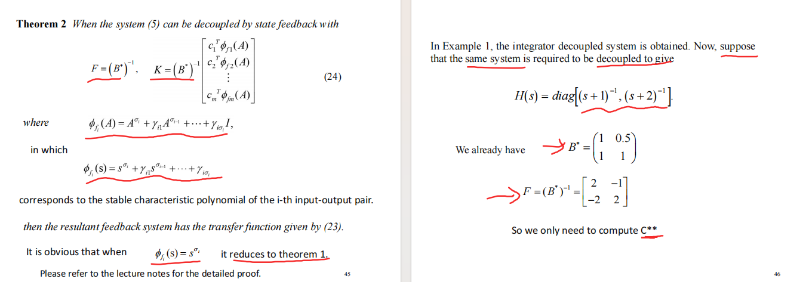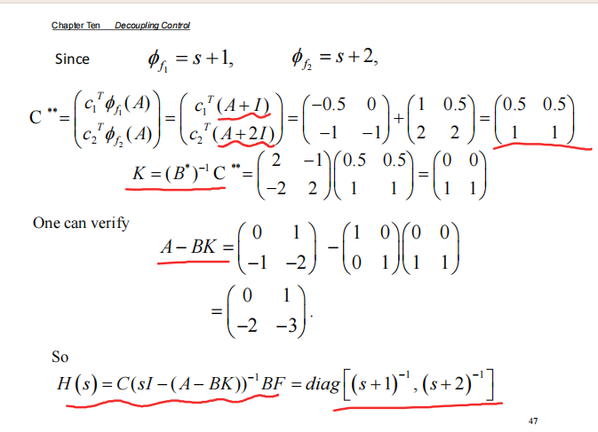

* * *

3. 任务实施步骤 (Implementation Steps)

为了完成任务，您需要在 MATLAB 中编写代码。以下是逻辑步骤：

### Step 1: 初始化参数与系统

* 根据您的学号后四位 $a,b,c,d$ 计算矩阵 $A, B, C$。

* 定义初始状态 $x_0$。

### Step 2: 检查解耦可行性 (Check Decouplability)

1. 计算第一行输出 $y_1$ 的相对阶 $\sigma_1$。

2. 计算第二行输出 $y_2$ 的相对阶 $\sigma_2$。

3. 构造矩阵 $B^*$。

4. 检查 `rank(B*)` 或 `det(B*)`。如果满秩，继续；否则无法解耦。

### Step 3: 设计稳定多项式与控制器 (Design Controller)

1. **设定极点:** 为每个通道选择期望的闭环极点。
   
   * **注意:** 极点实部必须为负（如 -2, -5 等）。根据 Project 要求，Settling time < 20s，所以极点不能太靠近虚轴，也不能太远导致控制量过大。

2. **构造多项式 $\phi_{f_i}(A)$:**
   
   * 如果是 1 阶 ($\sigma=1$)，期望极点为 $-p$，则 $\phi(s) = s+p \implies \phi(A) = A + pI$。
   
   * 如果是 2 阶 ($\sigma=2$)，期望极点为 $-p_1, -p_2$，则 $\phi(s) = s^2 + (p_1+p_2)s + p_1p_2 \implies \phi(A) = A^2 + (p_1+p_2)A + p_1p_2I$。

3. **计算 $C^{**}$:**
   
   * $Row_1 = c_1 \times \phi_{f_1}(A)$
   
   * $Row_2 = c_2 \times \phi_{f_2}(A)$
   
   * $C^{**} = [Row_1; Row_2]$

4. **计算 $F$ 和 $K$:**
   
   * $F = \text{inv}(B^*)$
   
   * $K = \text{inv}(B^*) \times C^{**}$

### Step 4: 仿真与验证 (Simulation & Verification)

1. **构建闭环系统:**
   
   * $\dot{x} = (A - BK)x + BFr$
   
   * $y = Cx$
   
   * 使用 `sys_cl = ss(A - B*K, B*F, C, 0)`。

2. **仿真 1: 阶跃响应 (Step Response)**
   
   * 运行 `step(sys_cl)`。
   
   * **预期结果:** 应该有 4 个子图。
     
     * $(1,1)$ 图 ($r_1 \to y_1$) 和 $(2,2)$ 图 ($r_2 \to y_2$) 应该显示稳定的阶跃响应，最终收敛。
     
     * $(1,2)$ 图 ($r_2 \to y_1$) 和 $(2,1)$ 图 ($r_1 \to y_2$) 应该**始终为 0**（或极小值），证明解耦成功。

3. **仿真 2: 零输入响应 (Internal Stability)**
   
   * 运行 `initial(sys_cl, x0)`。
   
   * **预期结果:** 所有状态变量 $x_1, x_2, x_3, x_4$ 都应随时间收敛到 0。

### Step 5: 内部稳定性分析 (Analysis)

* 计算闭环矩阵的特征值: `eig(A - B*K)`。

* **结论判断:**
  
  * 如果所有特征值的实部都严格小于 0，则系统是内部稳定的。
  
  * 如果在解耦过程中发生了**不可观测的零极点对消**（unstable pole-zero cancellation），且被对消的模态是不稳定的，那么系统外部（输入输出）看起来稳定，但内部（状态）是不稳定的。
  
  * 通过观察 `initial` 响应和 `eig` 结果来回答 Task 4 的最后一个问题。
    
    

---

## 任务 5 ：带扰动抑制的伺服控制 - chapter 9 + chapter 11

任务原文要求：In an application, the operating set point for the two outputs is

$y_{sp} = [0.4, 0.8] ^T$

Assume that you only have two sensors to measure the output. Design a controller such that the plant (the diesel engine system) can operate around the set point as close as possible at steady state even when step disturbances are present at the plant input. Plot out both the control and output signals. In your simulation, you may assume the step disturbance of magnitude $𝑤 =[0.3, 0.2]^𝑇$ takes effect from time $𝑡_𝑑 = 10𝑠$ afterwards.

#### 1. 任务目标与要求

根据 Mini-project 文件第 5 页的描述：

* **控制目标**：设计一个控制器，使柴油机空气系统（MIMO系统）的输出 $y$ 能够跟踪给定的设定点 $y_{sp}$，并能在存在扰动的情况下保持稳态误差为零。

* **设定点 (Set Point)**：$y_{sp} = [0.4, 0.8]^T$（分别对应空燃比 AFR 和 EGR 率）。

* **传感器限制**：**仅有两个传感器用于测量输出**（这意味着我们不能直接得到状态变量 $x$，需要结合观测器或使用输出反馈）。

* **扰动 (Disturbance)**：在 $t_d = 10s$ 时，输入端加入阶跃扰动 $w = [0.3, 0.2]$。即实际输入变为 $u_{actual} = u_{control} + w$。

* **输出要求**：绘制控制信号 $u$ 和输出信号 $y$ 的曲线。

#### 2. 核心挑战

* **稳态精度**：标准的 LQR 或极点配置（State Feedback）通常只能保证系统稳定，不能保证在有扰动或非零设定点时的稳态误差为零。

* **抗扰动**：系统必须具有“伺服机制”（Servo Mechanism），通常通过引入**积分器（Integrator）**来实现。

* **状态不可测**：由于题目强调“只有两个输出传感器”，如果采用状态反馈架构，必须配合 **Task 3** 中设计的**状态观测器**来估计状态 $x$。

### Chapter 9 理论知识对应索引

Task 5 的核心解决方案是 **多变量积分控制（Multivariable Integral Control）**，也称为 **伺服控制（Servo Control）**。以下是具体理论在 `Chapter9_Slide.pdf` 中的位置：

#### 1. 为什么要引入积分器？(Servo Mechanism)

* **理论点**：为了消除对阶跃参考信号（Step Reference）和阶跃扰动（Step Disturbance）的稳态误差，控制器必须包含积分环节（$1/s$）。这是“内部模型原理”的应用。

* **课件索引**：
  
  * **Slide 5 & 34**：展示了在 SISO 系统中引入积分器（$1/s$）可以实现常数输入的零稳态误差。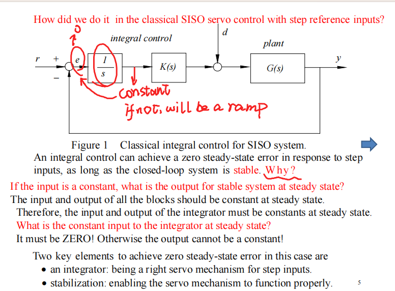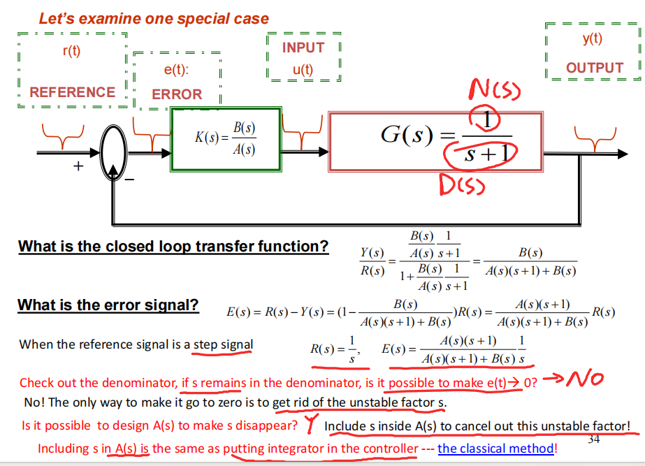
  
  * **Slide 64**：强调了积分器是消除稳态误差的“魔法武器”（Magic weapon）。

#### 2. MIMO 系统的积分控制设计 (Augmented System)

* **理论点**：对于多输入多输出系统，不能简单地像 SISO 那样加积分器。我们需要构造一个**增广状态空间模型（Augmented State Space Model）**。
  
  * 定义误差：$e(t) = y_{sp} - y(t)$。
  
  * 引入新的积分状态变量：$v(t) = \int e(t) dt$，即 $\dot{v}(t) = e(t) = y_{sp} - Cx(t)$。
  
  * 将原状态 $x$ 和积分状态 $v$ 合并，形成新的增广系统。

* **课件索引**：
  
  * **Slide 58-59**：引出多变量积分控制的需求。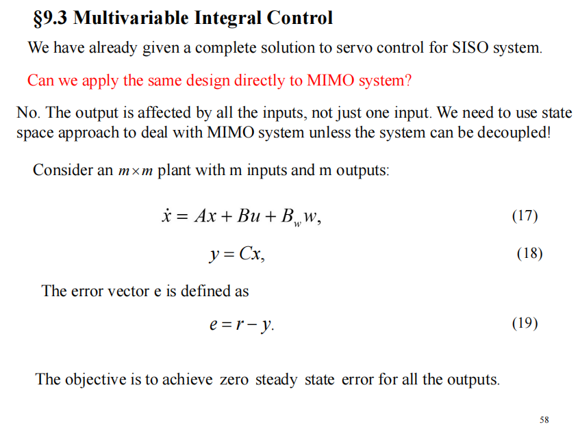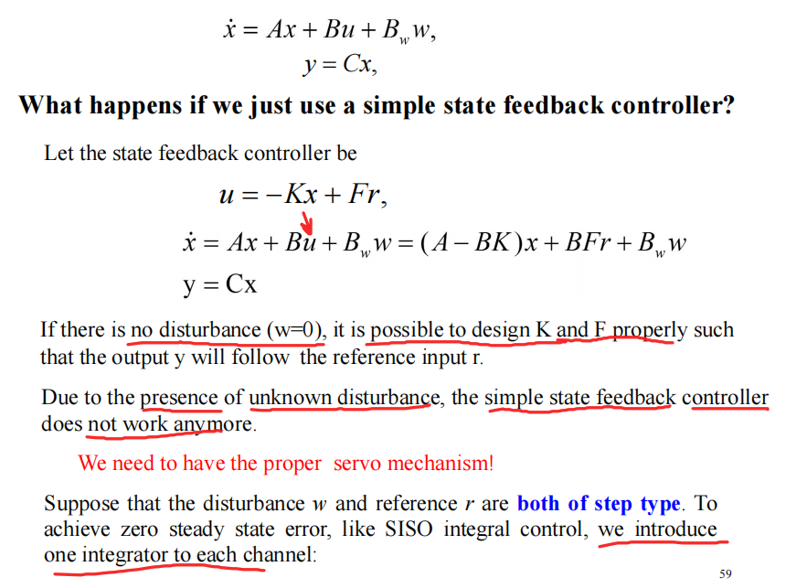
  
  * **Slide 60：关键页**。给出了误差定义 $\dot{v} = r - y$ 和增广系统的状态方程矩阵形式：
    $\begin{bmatrix} \dot{x} \\ \dot{v} \end{bmatrix} = \begin{bmatrix} A & 0 \\ -C & 0 \end{bmatrix} \begin{bmatrix} x \\ v \end{bmatrix} + \begin{bmatrix} B \\ 0 \end{bmatrix} u + \begin{bmatrix} 0 \\ I \end{bmatrix} r$

#### 3. 增广系统的可控性

* **理论点**：在设计控制器之前，必须检查增广系统是否可控。只有可控，才能任意配置极点或设计 LQR。

* **课件索引**：
  
  * **Slide 61**：给出了增广系统可控的充要条件，即 rank check。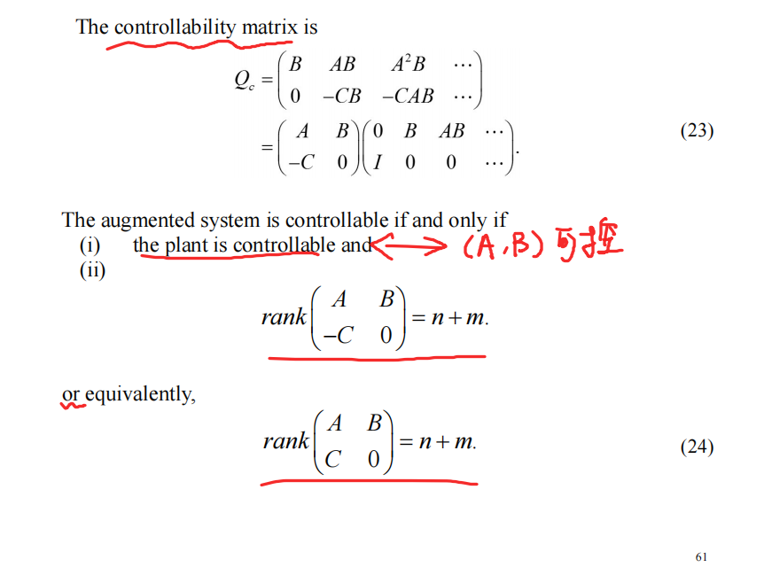

#### 4. 控制律设计 (State Feedback with Integral)

* 理论点：对增广系统设计状态反馈。控制律的形式为：
  $u = -K \bar{x} = -[K_1 \quad K_2] \begin{bmatrix} x \\ v \end{bmatrix} = -K_1 x - K_2 \int (r-y) dt$
  这里 $K_1$ 是原状态的反馈增益，$K_2$ 是积分误差的反馈增益。

* **课件索引**：
  
  * **Slide 62**：明确给出了带有积分控制的状态反馈公式。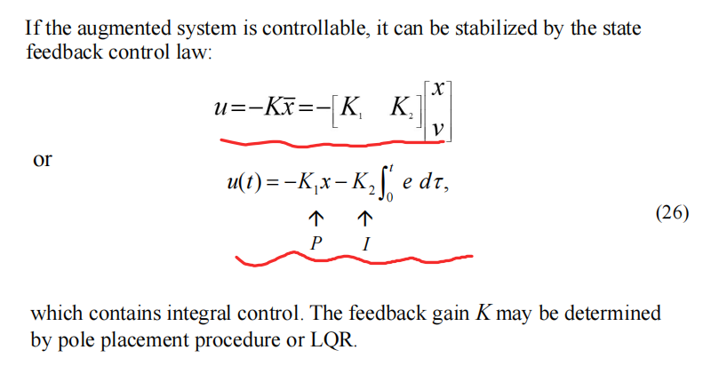
  
  * **Slide 67**：**关键页**。展示了如何对增广系统应用 **LQR** 方法来计算增益矩阵 $K$（这结合了 Chapter 8 的知识，非常适合 Task 5）。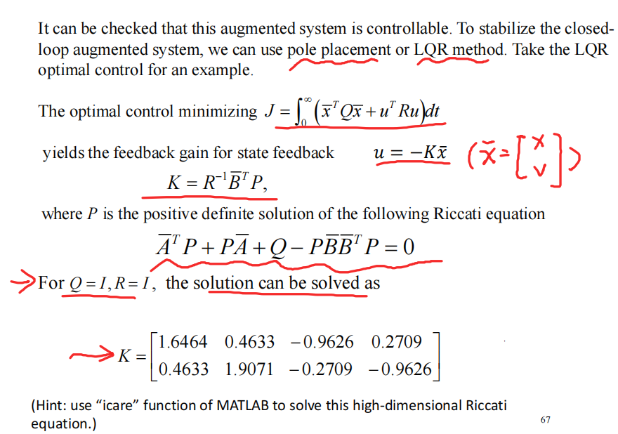

#### 5. 结合观测器 (Observer Integration)

* **理论点**：由于 Task 5 限制只能测量输出 $y$，我们不能直接得到 $x$。因此，公式中的 $-K_1 x$ 必须替换为 $-K_1 \hat{x}$，其中 $\hat{x}$ 来自观测器。

* **课件索引**：
  
  * **Chapter 9 Slide 65**：展示了 MIMO 积分控制系统的框图（Figure 6），但这页假设知道 $x$。
  
  * 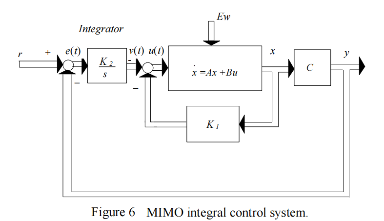
  
  * **Chapter 11 Slide 41 (Figure 5)**：虽然不在 Chapter 9，但这是 Task 5 实现的关键架构——**Plant + Observer + Integral Controller**。

* * *

### Task 5 完成步骤规划

基于上述分析，我们将按以下步骤编写代码：

1. **定义增广系统**：
   
   * 构建增广矩阵 $\bar{A} = \begin{bmatrix} A & 0 \\ -C & 0 \end{bmatrix}$ 和 $\bar{B} = \begin{bmatrix} B \\ 0 \end{bmatrix}$。
   
   * 注意：这里 $C$ 对应的是我们需要跟踪的输出（题目中所有输出都需要跟踪，所以就是原 $C$）。

2. **设计控制器增益 (Servo LQR)**：
   
   * 设置增广系统的权重矩阵 $\bar{Q}$ 和 $\bar{R}$。通常 $\bar{Q}$ 会对积分状态 $v$ 给与一定的权重，以消除稳态误差。
   
   * 使用 `lqr` 函数计算增广反馈增益 $K_{aug} = [K_x, K_v]$。

3. **集成观测器 (复用 Task 3)**：
   
   * 使用 Task 3 中设计的观测器增益 $L$ 来估计 $\hat{x}$。
   
   * 注意：观测器使用的是实际输入 $u$ 和实际输出 $y$。

4. **构建闭环系统仿真 (Simulink 或 ODE solver)**：
   
   * **状态导数**：$\dot{x} = Ax + B(u + w)$ （注意加入扰动 $w$）。
   
   * **观测器导数**：$\dot{\hat{x}} = A\hat{x} + Bu + L(y - C\hat{x})$。
   
   * **积分器导数**：$\dot{v} = y_{sp} - y$。
   
   * **控制律**：$u = -K_x \hat{x} - K_v v$。
   
   * **扰动逻辑**：在 $t \ge 10$ 时，将 $w$ 加到 $B$ 的输入端。

5. **绘图**：
   
   * 绘制 $y_1, y_2$ 与 $y_{sp}$ 的对比图（验证跟踪和抗扰）。
   
   * 绘制控制输入 $u_1, u_2$ 的图。
     
     

---

## 任务6梳理：状态调节与优化控制 -- chapter7+8+9

#### 1. 任务目标 (Problem Statement)

Task 6 是一个更具探索性的任务，它的核心不再是控制输出 $y$ (Output Regulation)，而是直接控制内部状态 $x$ (State Regulation)。

* **目标**：将系统的 4 个状态变量 $x$ 维持在给定的稳态设定点 $x_{sp} = [0, 0.5, -0.4, 0.3]^T$。

* **条件**：假设所有状态变量可测，且无干扰。

* **具体步骤**：
  
  1. **(a) 可行性分析**：判断是否可能让系统精确停留在 $x_{sp}$？（即是否存在输入 $u$ 能维持该状态？）
  
  2. **(b) 优化问题 (重点)**：如果无法精确达到 $x_{sp}$，我们需要找到一个“最接近” $x_{sp}$ 的稳态点 $x_s$。
     
     * **指标函数**：$J(x_s) = \frac{1}{2}(x_s - x_{sp})^T W (x_s - x_{sp})$
     
     * **权重矩阵**：$W = \text{diag}(a+1, b+1, c+1, d+1)$，基于您的学号参数 ($a=8, b=4, c=0, d=1$)。
  
  3. **控制器设计**：设计控制器将系统稳定在计算出的最优稳态点 $x_s^*$。

* * *

#### 2. 理论分析与解决思路 (Solution Strategy)

我们将这个问题拆解为三个数学步骤：

##### **步骤一：可行性分析 (Feasibility Check)**

* **理论基础**：线性系统的平衡点 (Equilibrium Point)。

* 分析逻辑：
  在稳态时，状态导数 $\dot{x} = 0$。根据系统方程 $\dot{x} = Ax + Bu$，若要系统停留在 $x_{sp}$，必须存在恒定的输入 $u_{ss}$ 满足：
  $0 = A x_{sp} + B u_{ss}$
  即：
  $B u_{ss} = -A x_{sp}$

* **对应课程内容**：
  
  * 这属于线性代数方程组求解问题 $Ax=b$。
  
  * **维度分析**：$B$ 矩阵是 $4 \times 2$ 的（4 个方程，2 个未知数 $u$）。这是一个**超定方程组 (Overdetermined System)**。
  
  * **结论预测**：除非 $-A x_{sp}$ 恰好落在 $B$ 的列空间 (Column Space) 内，否则方程无解。这意味着我们无法精确将状态维持在任意给定的 $x_{sp}$。

##### **步骤二：稳态优化 (Optimization)**

既然无法精确达到 $x_{sp}$，我们需要找到一个物理上可行的稳态点 $x_s$（满足 $Ax_s + Bu_s = 0$），使得它与目标 $x_{sp}$ 的加权距离 $J$ 最小。

* **数学推导**：
  
  1. 由稳态约束 $Ax_s + Bu_s = 0$，假设 $A$ 可逆（对于本系统成立），我们有：
     $x_s = -A^{-1} B u_s$
     令 $M = -A^{-1} B$，则 $x_s = M u_s$
  
  2. 将 $x_s$ 代入目标函数 $J$：
     $J(u_s) = \frac{1}{2} (M u_s - x_{sp})^T W (M u_s - x_{sp})$
  
  3. 这是一个关于 $u_s$ 的二次规划问题（无约束最小二乘问题）。对 $u_s$ 求导并令其为 0：
     $\frac{\partial J}{\partial u_s} = M^T W (M u_s - x_{sp}) = 0$
  
  4. 最优控制输入解：
     $u_s^* = (M^T W M)^{-1} M^T W x_{sp}$
  
  5. 最优稳态状态解：
     $x_s^* = M u_s^*$

* **对应课程内容**：
  
  * **Chapter 8 (Quadratic Optimal Control)**: 虽然这里解的是静态优化而非动态轨迹优化，但目标函数 $x^T W x$ 的形式与 LQR 中的 $x^T Q x$ 物理意义一致（Slide 7-8），即通过权重矩阵 $W$ 来权衡不同状态误差的重要性。

##### **步骤三：控制器实现 (Controller Implementation)**

我们计算出了最优的稳态输入 $u_s^*$ 和对应的最优稳态 $x_s^*$。现在需要设计控制器让系统从初始状态收敛到这个点。

* 控制律设计：
  我们需要一个控制律，既能提供维持稳态所需的能量 ($u_s^*$)，又能消除偏差 ($x - x_s^*$)。
  $u(t) = u_s^* - K (x(t) - x_s^*)$
  或者整理为：
  $u(t) = -K x(t) + (u_s^* + K x_s^*)$
  这相当于一个带有前馈 (Feedforward) 的状态反馈控制器。

* **对应课程内容**：
  
  * **Chapter 7 (Pole Placement)** 或 **Chapter 8 (LQR)**: 用于设计反馈增益矩阵 $K$ 以保证闭环系统稳定（矩阵 $A-BK$ 稳定）。
  
  * **Chapter 9 (Servo Control)**: 虽然这不是典型的伺服问题（无积分器），但它体现了 Slide 6 中提到的 "Structure of Controller" —— 包含反馈 (Stabilization) 和前馈/设定点管理。

#### 3. 课程 Slide 知识点映射索引

为了完成 Task 6，您将主要用到以下章节的知识：

| **步骤**      | **涉及概念**             | **对应 Slide 章节**             | **备注**                                |
| ----------- | -------------------- | --------------------------- | ------------------------------------- |
| **6(a) 分析** | 稳态平衡条件 $\dot{x}=0$   | **Chapter 7 (Part 1 基础回顾)** | 状态空间方程的基本性质                           |
| **6(b) 权重** | 权重矩阵 $W$ 的物理意义       | **Chapter 8 (Slide 7-8)**   | 类似于 LQR 中的 $Q$ 矩阵，表示对不同状态误差的惩罚权重      |
| **6(b) 求解** | 最小二乘法/二次型优化          | **(通用数学/线性代数)**             | 虽然 Slide 未直接列出静态优化公式，但这是 LQR 的数学基础    |
| **控制器设计**   | 状态反馈 $u=-Kx$         | **Chapter 7 (Slide 15)**    | 用于使误差动态收敛                             |
| **控制器设计**   | 引入参考输入 $N_{bar}$ 或前馈 | **Chapter 9 (Slide 17)**    | 类似于 $u = -Kx + Fr$，这里 $F$ 需要我们根据稳态值计算 |

#### 4. 接下来我们在 MATLAB 中要做什么？

既然逻辑已梳理清楚，下一步我将为您编写 **Task 6 的 MATLAB 代码**。代码将包含以下模块：

1. **参数定义**：计算您学号对应的权重矩阵 $W = \text{diag}(9, 5, 1, 2)$。

2. **不可行性验证**：计算 $\text{rank}([B, -Ax_{sp}])$，证明方程无解。

3. **最优稳态计算**：
   
   * 计算映射矩阵 $M = -A^{-1}B$。
   
   * 求解最小二乘解 $u_s^*$。
   
   * 计算最优稳态 $x_s^*$。

4. **控制器设计**：
   
   * 复用 Task 2 或重新设计一个 $K$（通常 LQR 得到的 $K$ 就很好）。
   
   * 构建控制律 $u = -K(x - x_s^*) + u_s^*$。

5. **仿真验证**：
   
   * 从零初始状态或指定初始状态开始。
   
   * 观察状态 $x$ 是否收敛到 $x_s^*$。
   
   * 计算并打印最终的加权误差值 $J(x_s^*)$。

---

### Remark：

请注意，上述所有设计问题均无唯一答案。对于我们的任务，在理想情况下，控制输入可以视为无限量。但现实中所有物理执行器的驱动能力都存在限制。

作为控制系统设计工程师，您需要根据实际情况做出专业判断。

在控制器设计与论证过程中，需重点考量以下三大要素：

- 速度-瞬态响应

- 准确度——稳态误差

- 成本——控制信号的大小

<mark>！请按照 线性系统 的设计流程来解决上述所有问题。在报告中列出必要的公式和中间结果。如果只是调用MATLAB的内置函数进行控制系统设计而没有详细说明，例如，只是简单地用place来放置极点或者用lqr来设计LQR调节器，那么你将得到零分。！</mark>
